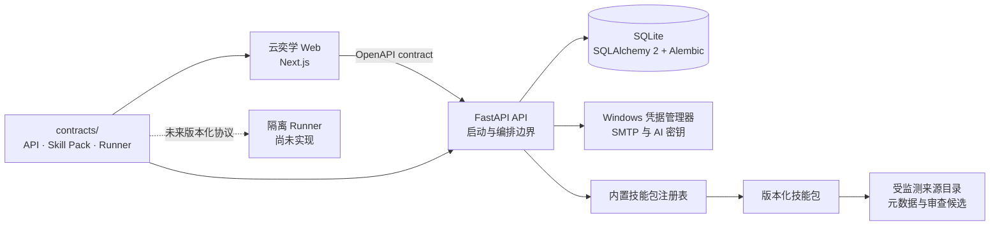

# 云奕学

> 一个以掌握证据为核心的本地 AI 技能学习平台。

一个本地优先、以可观察证据评估掌握程度的 AI 学习系统。它的目标不只是帮助用户“看完课程”，而是形成完整闭环：

**诊断 → 学习 → 练习 → 项目 → 评估 → 复习 → 变现实验**

当前项目仅供仓库所有者本人使用，首个技能为**算法**。项目仍处于早期开发阶段，请参阅下方的[当前进度](#当前进度)，不要将路线图中的能力视为已经实现。

## 项目目标

这个项目希望帮助用户：

- 系统学习一项技能，并找出真正的知识缺口；
- 通过解释、练习、迁移任务和真实作品证明掌握程度；
- 根据实际能力证据，评估就业、自由职业接单和产品化三条路径；
- 追踪知识与市场变化，在用户确认后更新学习安排；
- 保留来源、版本、评估和计划变更记录，使关键结论可以追溯。

系统不会因为用户看完内容或通过一次简单测验就宣称“完全掌握”，也不会把预测的工作机会或收入描述为确定结果。

## 首个技能：算法

算法技能包采用“共同主干 + 分支解锁”的结构：

1. 先通过诊断确认 Python、C/C++ 和必要数学基础；
2. 补牢数据结构与算法共同主干；
3. 通过阶段评估后，逐步解锁以下方向：
   - 工程应用；
   - 求职面试；
   - 算法竞赛；
   - 算法理论。

实践以 C++ 为主，同时支持 Python，并比较两种语言的实现方式、标准库和性能差异。学习任务预计可拆分为每天约 2 小时的可调整安排，但最终计划必须基于真实诊断结果生成。

## 当前进度

| 能力 | 状态 | 说明 |
| --- | --- | --- |
| 项目骨架 | 已完成 | Next.js、FastAPI、SQLite、SQLAlchemy 2、Alembic |
| 确定性本地检查 | 已通过（2026-07-29） | Node 24 下完整 `release-readiness` 通过，覆盖仓库治理、前后端质量、桌面/移动 E2E、契约漂移和敏感信息扫描 |
| GitHub Actions 基线 | 已验证（2026-07-29） | 4A 合并后的 `main` 工作流 16 项作业全部成功 |
| 技能包治理骨架 | 已完成 | 注册表、manifest、内容哈希、Schema 和依赖图检查 |
| 初版视觉方向 | 已应用于预览 | “静水深流”：克制、清晰、重证据，仍可根据真实使用体验修改 |
| 算法技能包 | 4A 受限草稿预览 | 保留 `0.1.0` 历史并以 `0.2.0` 提供全新诊断、学习活动、评估、证据和复习策略 |
| 自适应诊断访谈 | 最小闭环已完成 | 支持分支、跳过、不确定、修正、恢复、超时结束和审计记录 |
| AI 供应商档案 | 接口与本地实现 | 可保存 OpenAI、DeepSeek、Moonshot AI 和自定义端点档案；只有本地模拟可执行 |
| 学习计划与面板 | 受限预览已完成 | 可生成、修改、保存或否决来源支持的规划，保留变更审计 |
| 来源更新检查 | 有限闭环已完成 | 每日首次学习检查固定目录；失败不阻断学习，变化只生成待审候选 |
| 站内通知与邮件 | 有限闭环已完成 | 站内中心、级别偏好、延迟/已读取消及网站运行期间 SMTP 邮件 |
| 第四里程碑 4A | 已合并并验证 | PR #2 已合并到 `main@953d2d2`；共同主干入口覆盖学习、练习、追加纠错、六维受限证据和第 1、2、4、7、15 天复习 |
| 第五里程碑 5A | Draft PR 已验证 | 用户目标选择、六维证据门禁、不可变策略/合成市场快照、三路径比较与审计已通过本地 `release-readiness` 及 PR #3 远程 CI；尚未合并到 `main` |
| 隔离代码运行 | 延后 | 编程练习阶段经确认后再评估 Docker/WSL |
| 互联网部署 | 延后 | 本地验证达标并获得确认后再设计 |

当前 Web 页面提供算法诊断、规划、学习执行和目标准备度的本地受限流程。规划、确定性练习和 5A 准备度比较由本地规则处理；自由文本和代码文本只做结构校验，不能据此判断内容正确，也不代表算法技能包已经激活、用户已经掌握相关能力或已经具备真实交付资格。

第四里程碑的详细边界见 [`docs/architecture/learning-execution.md`](docs/architecture/learning-execution.md)，第五里程碑目标见
[`docs/architecture/monetization-and-continuous-update.md`](docs/architecture/monetization-and-continuous-update.md)，后续门禁和实施事项见根目录
[`TODO.md`](TODO.md)。

## 架构概览



FastAPI 启动时会验证仓库内置技能包的一致性。注册表缺失、manifest 校验失败、内容哈希不符或依赖图无效时，应用必须拒绝启动。

技能包中的评分器、自定义校验脚本和用户代码不得直接进入 FastAPI 进程。未来需要执行代码时，只能通过版本化、资源受限的隔离 Runner 协议调用。

## 技术栈

### Web

- Node.js 24 LTS
- Next.js 16
- React 19
- TypeScript
- pnpm 11
- ESLint
- Vitest
- Playwright

### API 与数据

- Python 3.14.3
- FastAPI
- SQLAlchemy 2
- Alembic
- SQLite
- uv
- Ruff、mypy、pytest

### 工程治理

- JSON Schema
- OpenAPI 与生成的 TypeScript 契约
- GitHub Actions
- 技能包注册表、内容摘要和依赖图校验

## 仓库结构

```text
.
├── apps/
│   ├── api/                    # FastAPI、SQLAlchemy、Alembic 与后端测试
│   └── web/                    # Next.js Web 应用
├── contracts/
│   ├── api/                    # 由 FastAPI 生成的 OpenAPI 契约
│   ├── readiness/              # 目标、准备度、合成市场快照与比较 Schema
│   ├── runner/                 # 隔离 Runner 协议 Schema
│   └── skill-pack/             # 注册表与 manifest Schema
├── docs/
│   └── architecture/           # 已确认的架构设计
├── readiness/                  # 5A 本地策略与显著标记的合成夹具
├── skill-packs/
│   ├── registry.yaml           # 内置技能包注册表
│   └── algorithm/              # 算法技能包草稿
├── tools/                      # 仓库检查和契约生成工具
├── AGENTS.md                   # 项目级产品与工程约束
├── package.json                # 本地与 CI 的统一命令入口
├── pnpm-lock.yaml              # JavaScript 依赖锁
└── pnpm-workspace.yaml
```

## 本地运行

### 环境要求

- Node.js 24 LTS
- pnpm 11
- Python 3.14.3
- uv 0.11.x

项目和 CI 固定使用 Node.js 24 LTS。后端暂时固定 Python 3.14.3；如果必要依赖无法支持 Python 3.14，项目会停止并报告，不会静默降低 Python 版本。

### 安装依赖

在仓库根目录执行：

```powershell
pnpm install --frozen-lockfile
uv sync --project apps/api --locked
```

pnpm 只允许锁定依赖 `sharp` 和 `unrs-resolver` 执行安装脚本，其他依赖脚本不会被默认放行。

### 启动开发服务

分别打开两个终端：

```powershell
pnpm dev:api
```

```powershell
pnpm dev:web
```

- Web：<http://localhost:3000>
- API：<http://localhost:8000>
- API 文档：<http://localhost:8000/docs>
- 健康检查：<http://localhost:8000/health>

本地验证阶段没有账号登录。请勿将开发服务直接暴露到不受信任的网络。

主要页面：

- `/diagnostic`：本地确定性诊断访谈；
- `/learning`：规划预览、每日来源检查、变化候选和站内通知；
- `/readiness`：用户目标选择、六维证据准备度与本地合成三路径比较；
- `/settings`：通知邮件偏好和 AI 供应商档案。

真实邮件默认关闭。启用后由正在运行的 API 进程处理 SMTP 队列；网站和 API 停止时不会在后台定时发送。SMTP 密码和 AI API 密钥保存在 Windows 凭据管理器，SQLite 只记录凭据引用。

## 质量检查

运行完整的发布就绪基线：

```powershell
pnpm release-readiness
```

该命令和 GitHub Actions 使用相同的本地子命令，包括：

- Markdown 与仓库结构检查；
- 技能包注册表、manifest、内容哈希和依赖图检查；
- 来源目录权威性、可追溯性与 HTTPS 边界检查；
- 规划单元来源关联与可观察完成标准检查；
- 5A 合成市场快照、准备度策略与零外部调用边界检查；
- JSON Schema 与 OpenAPI 契约检查；
- Ruff 格式检查和 lint；
- mypy 严格类型检查；
- pytest 后端测试；
- ESLint、TypeScript 和 Vitest 前端检查；
- Next.js 生产构建；
- Chromium 桌面与移动视口端到端流程；
- 前后端契约无漂移检查；
- 敏感信息基线扫描。

单独运行某项检查时，可查看根目录 [`package.json`](package.json) 中的 `check:*` 命令。

## 数据、隐私与安全边界

- 当前诊断和规划预览只使用本地确定性适配器，不会向外部 AI API 发送数据；
- 外部发送采用两层授权：全局开关默认关闭，创建每次外部 AI 对话时还必须单独确认；
- 关闭全局开关会阻止外部 AI 会话继续发送，并明确保留原会话配置，不会静默切换供应商或模型；
- SMTP 和 AI API 密钥保存在 Windows 凭据管理器中，SQLite 只保存凭据引用和非敏感元数据；
- 后端不得向前端返回密钥原文，也不得把密钥写入日志；
- 来源远程检查失败不会阻止学习，但界面和站内通知会说明失败、最近成功时间及风险；
- 检测到远程变化只会生成候选记录，不能自动弃用技能包或改写计划；
- 当前多专家规划仅综合可追溯的公开成果，不模拟专家本人或暗示其认可；
- 外部内容、AI 输出、用户输入和第三方技能包都视为不可信输入；
- 无效的未来第三方技能包只能进入不可执行的只读隔离区；
- 当前没有执行用户代码、技能包评分器或自定义校验脚本。
- 5A 只读取应用内已持久化证据和仓库受管策略/合成夹具，不访问市场 API、远程网页、外部 AI、任意用户路径，也不创建真实实验。

## 开发路线

路线图表示当前方向，不是交付时间承诺。

1. **工程基线**
   - 项目骨架；
   - 本地确定性检查；
   - GitHub Actions；
   - 远程 CI 验证。
2. **算法诊断访谈最小闭环**
   - 已完成会话、可纠正回答、分支、跳过、不确定、恢复和审计记录；
   - 已完成本地确定性适配器、模型锁定和两层外部 AI 权限门禁；
   - 待确认真实供应商模型清单后，再接入 OpenAI、DeepSeek 和 Moonshot AI；
   - 算法技能包通过正式内容审核前，诊断结果只作为草稿预览。
3. **学习规划、来源和面板**
   - 已完成可修改、保存或否决的本地规划预览；
   - 已完成固定来源目录、每日元数据检查、失败提示和变化候选；
   - 已完成站内通知及网站运行期间的可选真实邮件；
   - 已完成 AI 供应商档案接口与本地模拟，真实模型调用仍未启用；
   - 正式计划、自动内容迁移和完整技能包激活仍需后续确认。
4. **练习、项目和掌握评估**
   - 4A 共同主干入口受限纵向切片已通过 PR #2 合并并完成 `main` 远程验证；
   - 已新增 `algorithm@0.2.0` 草稿并保留、冻结 `0.1.0` 历史引用；
   - 已建立不可变学习锁、追加式尝试、六维证据、纠错和第 1、2、4、7、15 天复习；
   - 代码在 4A 中只作为不可信文本保存，不执行，也不调用外部 AI；
   - 4B 隔离代码运行必须单独确认后实施。
5. **变现实验与持续更新**
   - 5A 已完成用户目标选择、本地确定性准备度、合成市场证据、三路径比较和追加式决定审计，并通过完整本地验证；
   - 考试、纯学习和其他非变现目标不会被强制进入就业或变现比较；
   - 5B 等待模型、目标市场、来源方案和预算确认后，才接入真实市场研究与持续更新；
   - 真实算法交付类实验等待 4B 或其他独立验证证据；
   - 不保证工作、订单或收入。
6. **互联网部署评估**
   - 本地版本通过约定标准后再选择平台；
   - 增加身份验证、访问控制和数据迁移方案。

## 项目约束与设计文档

开始修改前请先阅读：

- [项目级约束](AGENTS.md)
- [项目待办、门禁与验证证据](TODO.md)
- [技能包系统架构提案](docs/architecture/skill-pack-system.md)
- [诊断访谈最小闭环架构](docs/architecture/diagnostic-interview.md)
- [学习规划、来源、通知与供应商档案](docs/architecture/learning-planning.md)
- [第四里程碑学习执行与掌握证据](docs/architecture/learning-execution.md)
- [第五里程碑变现准备与持续更新目标](docs/architecture/monetization-and-continuous-update.md)
- [初版视觉方向提案](docs/design/visual-direction.md)

这些文档定义了产品边界、内容可信度、掌握评估、技能包治理、安全隔离和开发顺序。CI 基线未通过前，不得提前实现自适应访谈等业务功能。

## 许可证

Copyright © 2026 云奕学项目所有者（joonas-001）。

项目所有者拥有版权的项目代码和文档采用 [PolyForm Noncommercial License 1.0.0](LICENSE.md)：

- 允许许可证规定范围内的个人学习、研究、实验、修改和非商业分发；
- 不允许未经授权的商业使用；
- 商业使用需要另行获得版权所有者许可；
- 这是一份 source-available 非商业软件许可证，不是 MIT License，也不是 OSI 认可的开源许可证；
- 第三方依赖、工具和引用内容继续适用各自的许可证与条款。

请以 [`LICENSE.md`](LICENSE.md) 中的完整英文条款为准。
